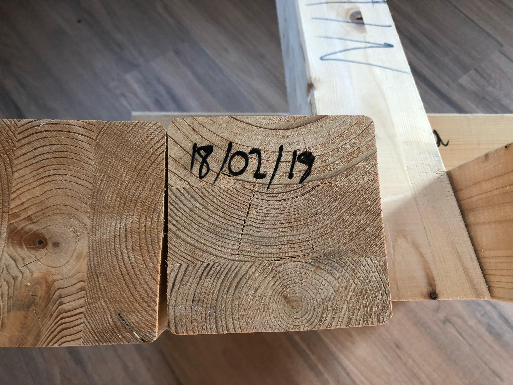

# Functional Sculpture: Podium

This podium is a functional sculpture. It was fashioned [Bricolage](https://en.wikipedia.org/wiki/Bricolage)-style from the scraps of building an original sound stage frame made out of 100x100mm pieces of spruce construction wood and a panel from an IKEA shelf system.

I thought of the concept, collected the material and a carpenter friend of mine assembled the pieces, making use of his woodworking equipment, which I didn't have at the time. The foot is made out of 4 wood pieces of equal length, bolted together in pairs. The support pillar for the top of the podium is cut at an angle and height for maximum reading comfort and visibility of the audience. A threaded rod is stuck through the base of the foot and centre pillar and another piece of wood bolted to the base keeps the centre pillar from tipping towards the speaker.

Transparency and non-obtrusiveness were the guiding principles of this piece of art.

Serial Number: 018-0218-001A

Measurements and a downloadable CAD drawing to be provided at a later date.

