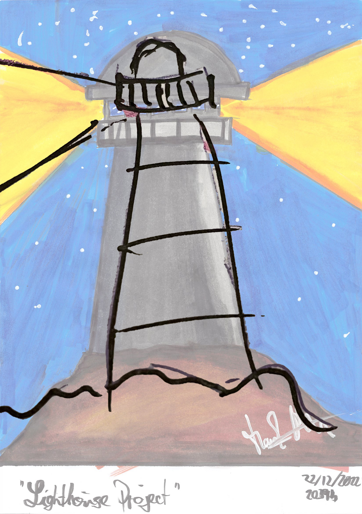
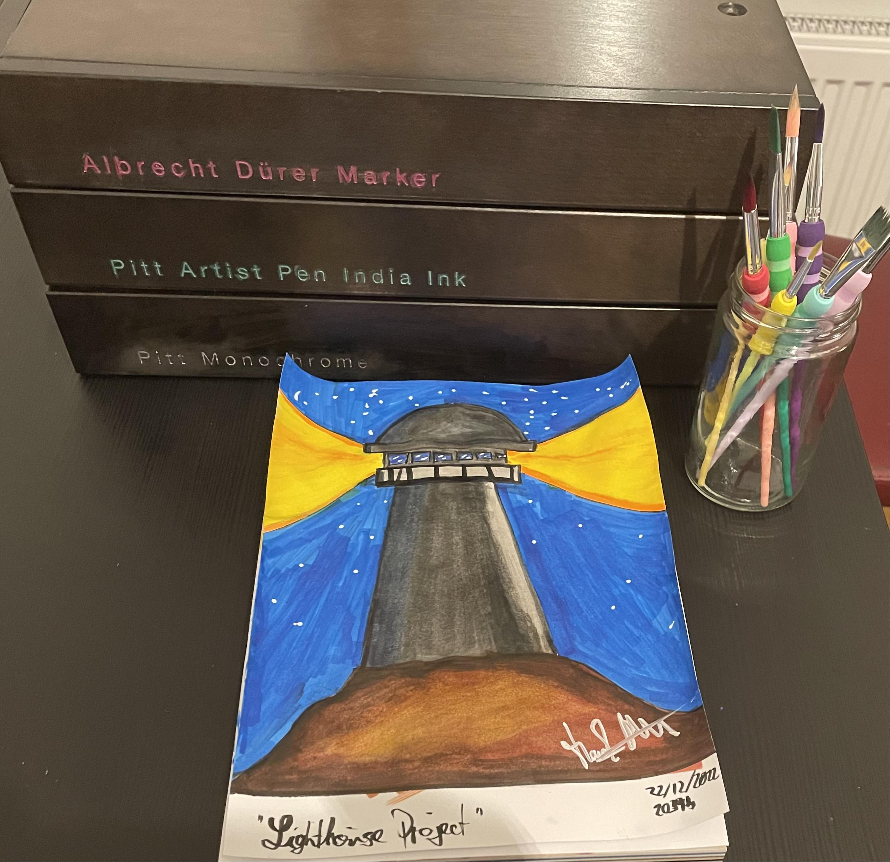

# Lighthouse Project

## Input

This lighthouse project started with a question my kid asked me if I could draw a lighthouse with some heavy waves in the ocean.

I accepted the challenge and started doodling some quick outlines on a piece of paper that was already filled with some freehand drawing exercises.

Highlighted with a [Uni-ball Gel Impact Black Broad 1.0mm](https://www.amazon.de/-/en/Uni-Ball-Impact-UM-153-Black-Rollerball/dp/B00U90K0JM) and cropped in to make it stand out for demonstration purposes and way after the actual work of art has been put on paper.

## Process

To highlight and pay respects to the creative process I have extracted, enlarged and overlayed the concept sketch over the result, showing how similar the product is to the original sketch. After creating the sketch I used a blank sheet of paper and outlined the contours with a [Faber-Castell Castell 9000 HB](https://www.faber-castell.de/produkte/Castell9000BleistiftHB/119000), traced the lines with a Pitt Artist Pen, erased the pencil sketch and then started colouring the piece.

## Output

These are most of the supplies I have used depicted alongside the finished artwork. I posted this image on my Facebook.

