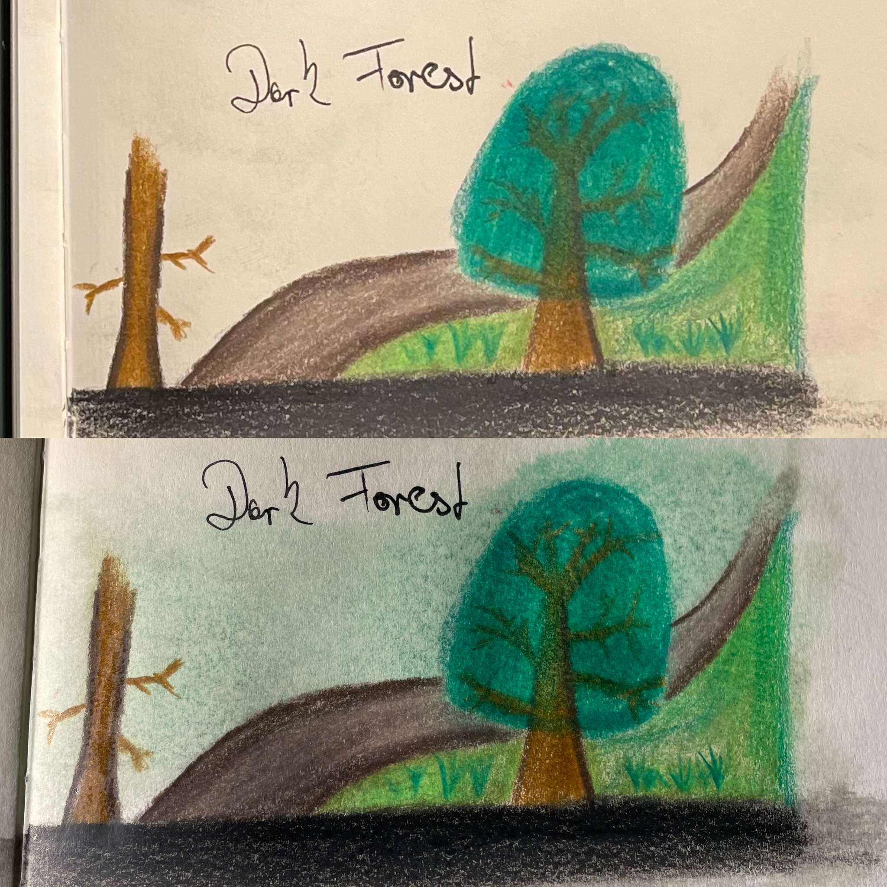
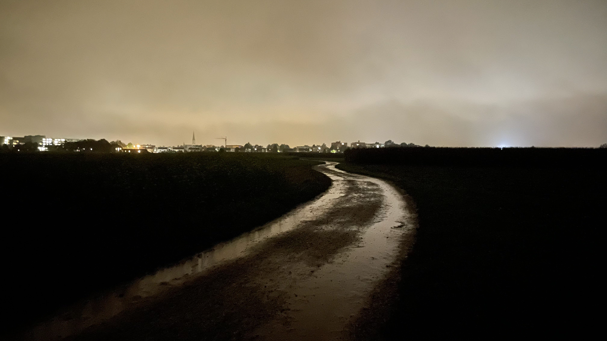

This is my first drawing entry for my sketchbook. I'm sharing my progress as an artist publicly as a function of accountability for myself.

Being inspired to pick up drawing by an idea for a collage that came to my head while I was in deep thought about present and future of my love relationship, I went out and bought some top quality art supplies to fuel the creative process.

- [Faber-Castell 24 Polychromos Colour Pencils](https://www.faber-castell.de/produkte/PolychromosFarbstift24erMetalletui/110024)
- [Paperblanks Notebook Dharma Dragon](https://www.amazon.de/-/en/Paperblanks-Notebook-Softcover-Collection-Android/dp/1439753741/)

While I'm fully aware that I'm just starting out on my journey I knew that I'm investing in myself with this kit to improve mental health as well as find artistic expression. Ideally at a level so I can *think it* and *create it* as close as possible in the tangible world as I had imagined it in my head.

I did some research on YouTube about how to make the best use of the Polychromos colour pencils, [how to blend colours](https://www.youtube.com/watch?v=u_NKbyztQVA) and drew some very quick studies before immediately diving into some coloured sketches.



The first draft was already coming together nicely and after some more research and further supplies (Odorless Mineral Spirit for blending) I experimented with activating the pigments which makes for some smooth blending and covers the paper in colour. I managed to create a green background only by using some odorless mineral spirit applied to the tree and using a brush to distribute the pigments across the entire sketch.

This is what it looked like before playing around with the new technique.

Next time I'll use some reference image to come up with a more suitable colour palette, perspective and elements.

Serial Number: 022-0922-001A
