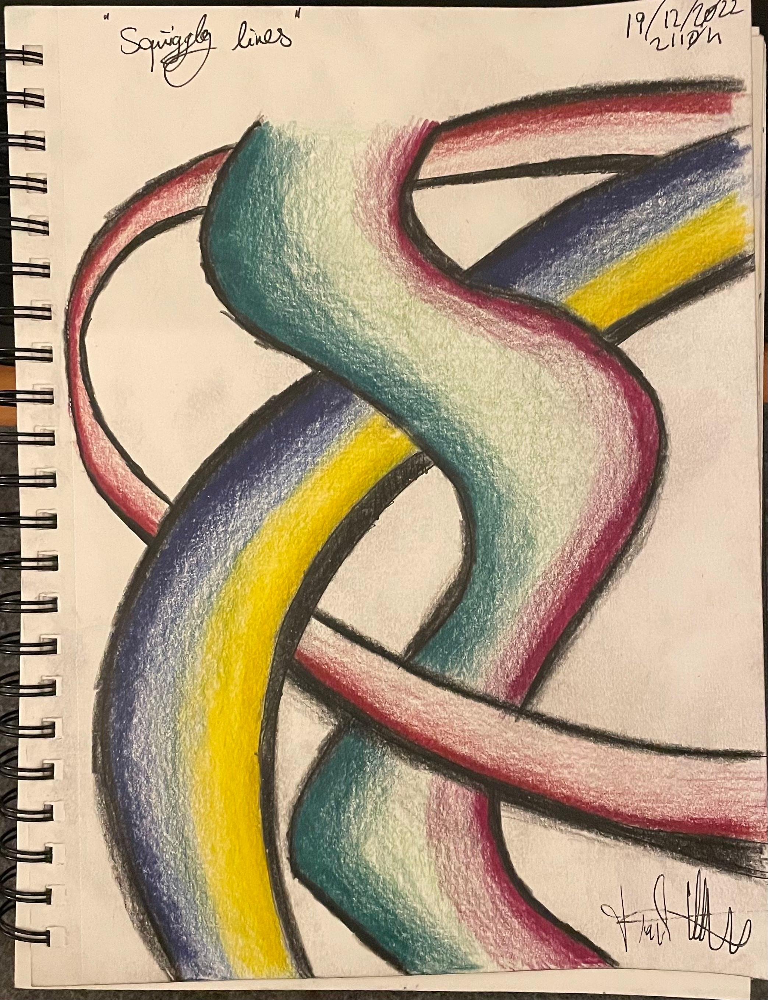
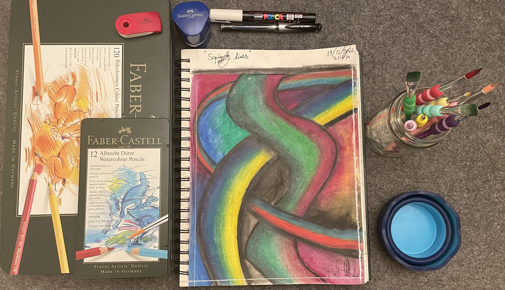
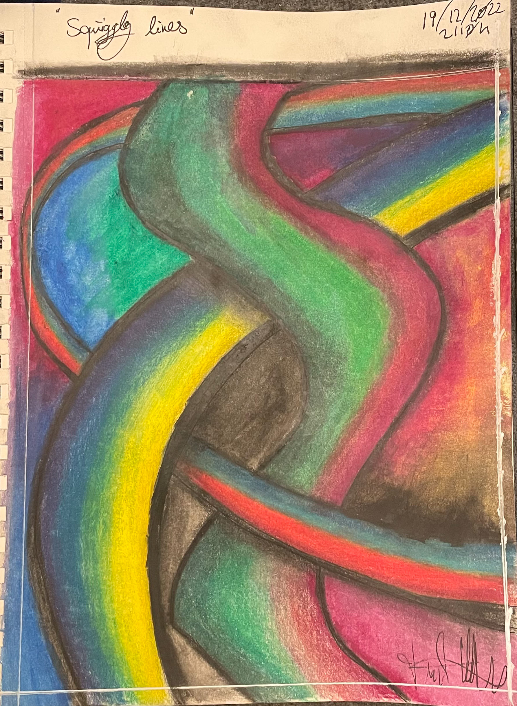

## Input

I wanted to exercise my blending techniques, depth, perspective and shading work, so I just penciled a few lines on a blank piece of paper and went from there.

## Process

I coloured the main lines and blended them using Polychromos and filled the gaps between them with Albrecht Dürer Watercolour.

The supplies depicted in the above image are:

- [Faber-Castell 120 Polychromos Colour Pencils](https://www.faber-castell.de/produkte/PolychromosFarbstift120erMetalletui/110011)
- [Faber-Castell 12 Albrecht Dürer Watercolour Pencils](https://www.faber-castell.de/produkte/AlbrechtD%c3%bcrerAquarellstift12erMetalletui/117512)
- [Faber-Castell Grip 2001 Can Sharpener](https://www.faber-castell.de/produkte/Grip2001Dreifachspitzdosesilber/183800)
- [Faber-Castell Sleeve Eraser](https://www.faber-castell.de/produkte/SleeveRadierergr%c3%bcn/182402)
- [Faber-Castell 4-piece brush set with soft-grip sizes: 2/6/10/12](https://www.faber-castell.de/produkte/PinselmitSofttouchGriffst%c3%bcck4erSetGr%c3%b6%c3%9fen261012/481600)
- [Faber-Castell 4-piece brush set with soft-grip sizes: 4/8/10/12](https://www.faber-castell.de/produkte/SoftTouchPinselGr%c3%b6%c3%9fen481012/481620)

I'm using these brushes to apply odourless mineral spirits for the [Polychromos Colour Pencils](https://www.faber-castell.de/produkte/polychromos-kuenstlerfarbstifte/buntstifte) line and water for the [Albrecht Dürer Watercolour Pencils](https://www.faber-castell.de/produkte/albrecht-duerer/buntstifte) line.

## Output

To frame the entire piece I decided to go with a white rectangular outline. I'm quite happy the POSCA marker in white made a bit of a mess of a line. Still working on the layering techniques and the amount of pressure to apply as to not destroy the paper I'm working on.
